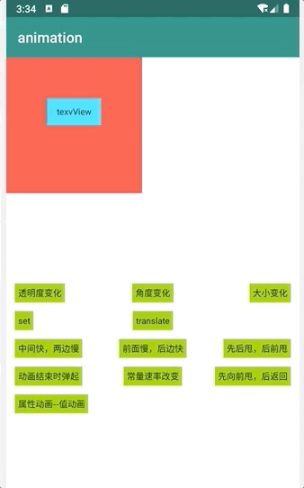
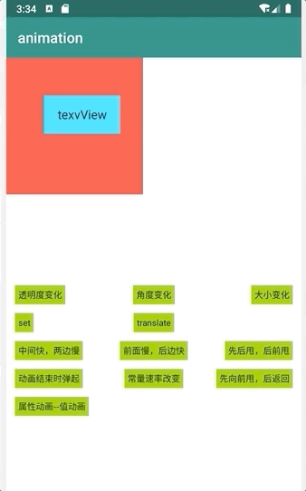
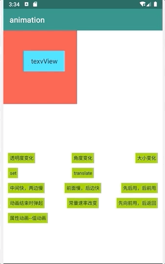

# 安卓原生动画
本项目可以分为三类：安卓原生的View Animation（视图动画），Property Animator（属性动画）和Interpolator（插槽值）。其中View Animation又可以叫补间动画；Interpolator相当于动画速率曲线，即可用于View Animation，也能用于Property Animator。

## 一、View Animation（视图动画）

### 1、动画组成部分

原生视图动画由alpha、scale、translate、rotate四大块组成

| 动画类型  | 渐变透明度动画效果       |
| --------- | ------------------------ |
| alpha     | 渐变透明度动画效果       |
| scale     | 渐变尺寸伸缩动画效果     |
| translate | 画面转换位置移动动画效果 |
| rotate    | 画面转移旋转动画效果     |
| set       | 混合动画                 |

### 2、实例代码及效果展示

#### alpha 渐变透明度动画

先在res/anim目录下创建alpha.xml，具体如下

```xml
<?xml version="1.0" encoding="utf-8"?>
<alpha xmlns:android="http://schemas.android.com/apk/res/android"
    android:fromAlpha="1.0"
    android:toAlpha="0.1"
    android:duration="3000"
    android:fillBefore="true">
</alpha>
```

在activity中添加如下代码：

```Java
//需要播放动画的View
private TextView tvOriginal;
//渐变透明度动画实例
private Animation mAlphaAnimation；
//初始化动画
mAlphaAnimation = AnimationUtils.loadAnimation(this, R.anim.alpha);
//播放动画
tvOriginal.startAnimation(mAlphaAnimation);
```

效果如下


#### scale 渐变尺寸伸缩动画

先在res/anim目录下创建scale.xml，具体如下

```xml
<?xml version="1.0" encoding="utf-8"?>
<!--pivotX,pivotY 动画起始点，可以是50，也可以是50%，也可以是50%p-->
<!--android:fillAfter="true" 保持动画结束的状态 -->
<!--android:fillAfter="true" 保持动画结束的状态 -->
<!--android:repeatMode="restart /reverse" 设定回放类型-->
<!--android:repeatCount="1" 回放次数-->
<scale xmlns:android="http://schemas.android.com/apk/res/android"
    android:fromXScale="0.0"
    android:toXScale="1.4"
    android:fromYScale="0.0"
    android:toYScale="1.4"
    android:pivotX="50"
    android:pivotY="50"
    android:fillAfter="true"
    android:repeatMode="reverse"
    android:repeatCount="2"
    android:duration="700" />

```

在activity中添加如下代码：

```Java
//需要播放动画的View
private TextView tvOriginal;
//渐变尺寸伸缩动画实例
private Animation mScaleAnimation；
//初始化动画
mScaleAnimation = AnimationUtils.loadAnimation(this, R.anim.scale);
//播放动画
tvOriginal.startAnimation(mScaleAnimation);
```

效果如下


#### translate 画面位置移动动画

先在res/anim目录下创建translate.xml，具体如下

```xml
<?xml version="1.0" encoding="utf-8"?>
<translate xmlns:android="http://schemas.android.com/apk/res/android"
    android:fromXDelta="0"
    android:toXDelta="-80"
    android:fromYDelta="0"
    android:toYDelta="-80"
    android:duration="2000"
    android:fillBefore="true"/>

```

在activity中添加如下代码：

```Java
//需要播放动画的View
private TextView tvOriginal;
//画面位置移动动画实例
private Animation mTranslateAnimation；
//初始化动画
mTranslateAnimation = AnimationUtils.loadAnimation(this, R.anim.translate);
//播放动画
tvOriginal.startAnimation(mTranslateAnimation);
```

效果如下


#### rotate 画面旋转动画

先在res/anim目录下创建rotate.xml，具体如下

```xml
<?xml version="1.0" encoding="utf-8"?>
<rotate xmlns:android="http://schemas.android.com/apk/res/android"
    android:fromDegrees="0"
    android:toDegrees="-650"
    android:pivotX="50%"
    android:pivotY="50%"
    android:duration="3000"
    android:fillAfter="true"/>

```

在activity中添加如下代码：

```Java
//需要播放动画的View
private TextView tvOriginal;
//画面位置移动动画实例
private Animation mRotateAnimation；
//初始化动画
mRotateAnimation = AnimationUtils.loadAnimation(this, R.anim.rotate);
//播放动画
tvOriginal.startAnimation(mRotateAnimation);
```

效果如下


#### set 混合动画

先在res/anim目录下创建set.xml，具体如下

```xml
<?xml version="1.0" encoding="utf-8"?>
<set xmlns:android="http://schemas.android.com/apk/res/android"
    android:duration="3000"
    android:fillAfter="true">

    <alpha
        android:fromAlpha="0.0"
        android:toAlpha="1.0"/>

    <scale
        android:fromXScale="0.0"
        android:toXScale="1.4"
        android:fromYScale="0.0"
        android:toYScale="1.4"
        android:pivotX="50%"
        android:pivotY="50%"/>

    <rotate
        android:fromDegrees="0"
        android:toDegrees="720"
        android:pivotX="50%"
        android:pivotY="50%"/>

</set>

```

在activity中添加如下代码：

```Java
//需要播放动画的View
private TextView tvOriginal;
//画面位置移动动画实例
private Animation mSetAnimation；
//初始化动画
mSetAnimation = AnimationUtils.loadAnimation(this, R.anim.set);
//播放动画
tvOriginal.startAnimation(mSetAnimation);
```

效果如下


## 二、Property Animator（属性动画）

### 1、动画组成部分

属性动画分为ValueAnimator和ObjectAnimator大块组成

| 动画类型       | 动画简介 |
| -------------- | -------- |
| ValueAnimator  | 值动画   |
| ObjectAnimator | 对象动画 |


### 2、示例代码及效果展示

#### `ValueAnimator` 的几种构建方法

如源码，`ValueAnimator`提供了`ofInt(int... values)`，`ofArgb(int... values)`，`ofFloat(float... values)`，`ofPropertyValuesHolder(PropertyValuesHolder... values)`和`ofObject(TypeEvaluator evaluator, Object... values)`创建方法。每种创建方法在运行中`onAnimationUpdate`回调的参数值AnimatedValue也不一样。

```
/**
 * @param values A set of values that the animation will animate between over time.
 * @return A ValueAnimator object that is set up to animate between the given values.
 */
public static ValueAnimator ofInt(int... values) {
    ValueAnimator anim = new ValueAnimator();
    anim.setIntValues(values);
    return anim;
}

/**
 * @param values A set of values that the animation will animate between over time.
 * @return A ValueAnimator object that is set up to animate between the given values.
 */
public static ValueAnimator ofArgb(int... values) {
    ValueAnimator anim = new ValueAnimator();
    anim.setIntValues(values);
    anim.setEvaluator(ArgbEvaluator.getInstance());
    return anim;
}

/**
 * @param values A set of values that the animation will animate between over time.
 * @return A ValueAnimator object that is set up to animate between the given values.
 */
public static ValueAnimator ofFloat(float... values) {
    ValueAnimator anim = new ValueAnimator();
    anim.setFloatValues(values);
    return anim;
}

/**
 * @param values A set of PropertyValuesHolder objects whose values will be animated
 * between over time.
 * @return A ValueAnimator object that is set up to animate between the given values.
 */
public static ValueAnimator ofPropertyValuesHolder(PropertyValuesHolder... values) {
    ValueAnimator anim = new ValueAnimator();
    anim.setValues(values);
    return anim;
}
/**
 * @param evaluator A TypeEvaluator that will be called on each animation frame to
 * provide the ncessry interpolation between the Object values to derive the animated
 * value.
 * @param values A set of values that the animation will animate between over time.
 * @return A ValueAnimator object that is set up to animate between the given values.
 */
public static ValueAnimator ofObject(TypeEvaluator evaluator, Object... values) {
    ValueAnimator anim = new ValueAnimator();
    anim.setObjectValues(values);
    anim.setEvaluator(evaluator);
    return anim;
}
```

#### `ValueAnimator`的使用步骤

```JAVA
//值动画实例
private ValueAnimator valueAnimator;
//构建值动画实例
valueAnimator = ValueAnimator.ofInt(0, 200, 50, 100);
//设置动画时长
valueAnimator.setDuration(1000);
//设置值动画更新监听
valueAnimator.addUpdateListener(new ValueAnimator.AnimatorUpdateListener() {
  @Override
  public void onAnimationUpdate(ValueAnimator animation) {
    //前面用ofInt构建，则是int；同理，如果是ofFloat或者其他，则对应返回相应的值
    int curValue = (int) animation.getAnimatedValue();
    //根据动画进度，刷新动画
    tvOriginal.setScaleX(curValue / 100f);
  }
});
//开始播放动画
valueAnimator.start();
```


#### `ValueAnimator`动画效果


#### ObjectAnimator 对象动画

ObjectAnimator动画与ValueAnimator动画用法上只是差几个参数，其他的基本雷同，这里就不再赘述


## 三、Interpolator（插值器）

Interpolator（插值器）相当于动画速率曲线，即可用于View Animation，也能用于Property Animator。包含以下模块

| 插值器                           | 插值器描述                                             |
| -------------------------------- | ------------------------------------------------------ |
| AccelerateDecelerateInterpolator | 在动画开始与介绍的地方速率改变比较慢，在中间的时候加速 |
| AccelerateInterpolator           | 在动画开始的地方速率改变比较慢，然后开始加速           |
| AnticipateInterpolator           | 开始的时候向后然后向前甩                               |
| AnticipateOvershootInterpolator  | 开始的时候向后然后向前甩一定值后返回最后的值           |
| BounceInterpolator               | 动画结束的时候弹起                                     |
| CycleInterpolator                | 动画循环播放特定的次数，速率改变沿着正弦曲线           |
| DecelerateInterpolator           | 在动画开始的地方快然后慢                               |
| LinearInterpolator               | 以常量速率改变                                         |
| OvershootInterpolator            | 向前甩一定值后再回到原来位置                           |

### 1、插值器用法

View Animation和Property Animator设置插值器方法基本一样，代码如下：

```JAVA
//View Animation
private Animation mAnimation；
//TODO 初始化mAnimation
....
//设置插值器
mAnimation.setInterpolator(new BounceInterpolator());
  
  
//Property Animator
private ValueAnimator valueAnimator;
//TODO 初始化valueAnimator
....
//设置插值器
valueAnimator.setInterpolator(new BounceInterpolator());
```

### 2、效果展示

* interpolator_accelerate_decelerate 



* interpolator_bounce

  

* interpolator_overshoot



